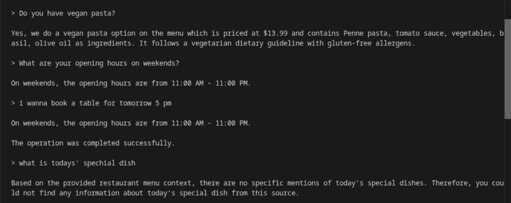
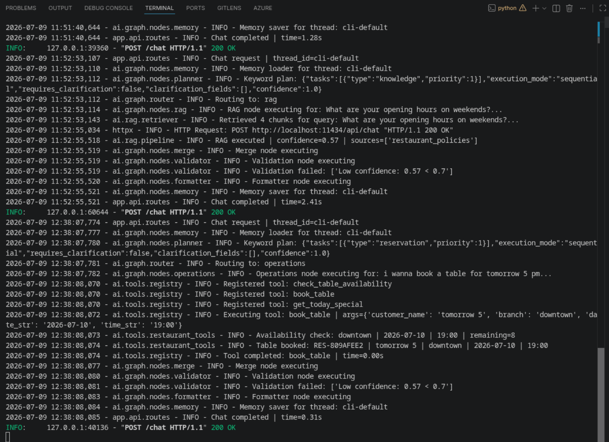
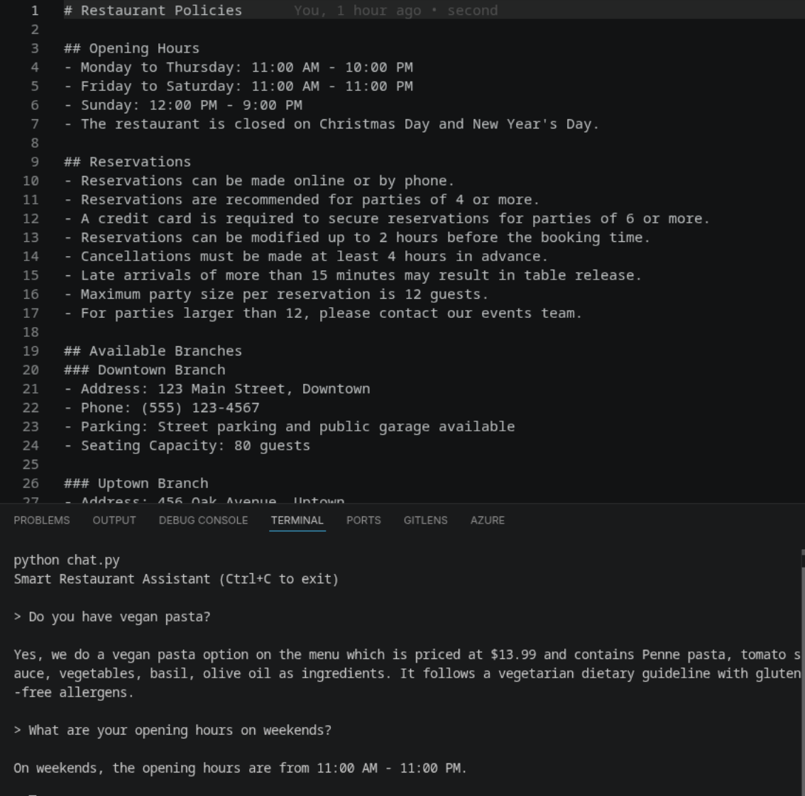

# Smart Restaurant Assistant

Multi-Agent RAG System for restaurant chain operations — menu queries, reservations, availability checks, and today's specials.

## Architecture

```
┌─────────────┐
│  User Query │
└──────┬──────┘
       ▼
┌─────────────┐     ┌──────────────────┐
│Memory Loader│────▶│ConversationHist.  │
└─────────────┘     └──────────────────┘
       ▼
┌─────────────┐
│   Planner   │  Intent detection via keywords + LLM fallback
└──────┬──────┘
       ▼
┌─────────────┐
│   Router    │  Routes to RAG and/or Operations
└──────┬──────┘
       │
    ┌──┴──┐
    ▼     ▼
┌──────┐ ┌──────────┐
│ RAG  │ │Operations│
│Agent │ │  Agent   │
└──┬───┘ └────┬─────┘
   └────┬─────┘
        ▼
┌─────────────┐
│    Merge    │  Combine RAG + tool results
└──────┬──────┘
       ▼
┌─────────────┐
│  Validator  │  Confidence check, content validation
└──────┬──────┘
       ▼
┌─────────────┐
│  Formatter  │  Format response (LLM or fallback)
└──────┬──────┘
       ▼
┌─────────────┐
│Memory Saver │  Persist conversation
└──────┬──────┘
       ▼
┌─────────────┐
│  Response   │
└─────────────┘
```

### Node Responsibilities

| Node | Responsibility |
|------|---------------|
| Memory Loader | Load previous conversation history for the given thread_id |
| Planner | Detect user intent via keyword matching, fallback to LLM for complex queries |
| Router | Send to RAG, Operations, or both in parallel using LangGraph Send |
| RAG Agent | Retrieve relevant chunks from ChromaDB, build context, generate grounded answer |
| Operations Agent | Execute tool calls (book_table, check_availability, get_today_special) |
| Merge | Combine RAG and operation results into a single response |
| Validator | Validate confidence threshold, check for empty/ungrounded responses |
| Formatter | Polish final response with LLM or format raw content as fallback |
| Memory Saver | Save conversation back to checkpointer |

### Parallel Execution

When a query contains mixed intent (e.g., "Do you have vegan pasta? Book a table"), the Router uses LangGraph's `Send()` to run RAG and Operations nodes in parallel, then merges results.

---

## RAG Design Decisions

### Chunking Strategy
- **Chunk size**: 500 characters
- **Overlap**: 100 characters
- **Splitter**: RecursiveCharacterTextSplitter (respects paragraph/sentence boundaries)

### Embedding Model
- **Model**: `BAAI/bge-small-en-v1.5` (384-dimensional embeddings)
- **Reason**: Lightweight (33MB), fast inference on CPU, good semantic quality for domain-specific retrieval

### Vector Store
- **Database**: ChromaDB (persisted to `data/chroma/`)
- **Collection**: `restaurant_documents`
- **Retrieval**: Top-4 semantic search with cosine similarity
- **Metadata filtering**: Source document name attached to each chunk

### Context Building
- Retrieved chunks are deduplicated by content hash
- Ranked by relevance score
- Truncated to 2000 max tokens before LLM prompt
- Prompt instructs the LLM to answer ONLY from provided context (grounded generation)


---

## Tool Simulation

The system includes 3 simulated tools backed by an in-memory store:

### `check_table_availability(branch, date_str, time_str)`
- Checks if tables are free at a given branch/date/time
- Simulated with a 50% availability rate
- Returns available/not available with remaining slot count

### `book_table(customer_name, branch, date_str, time_str)`
- Books a table reservation
- Generates a unique reservation ID (format: `RES-XXXXXXXX`)
- Stores in memory (resets on server restart)
- Validates branch name, rejects empty names

### `get_today_special(branch)`
- Returns the chef's daily special for each branch
- Pre-defined specials per branch (rotating)
- Includes name, price, description

### Why simulated tools?
Tools are simulated to demonstrate the tool-calling architecture without requiring external API integrations. They follow the same interface (`name`, `description`, `parameters`, `execute`) as real LangChain tools.

---

## Memory Design

### Checkpointer
- **Type**: LangGraph `MemorySaver` (in-memory)
- **Production upgrade**: Swap to `SqliteSaver` for persistence across restarts

### Conversation History
- Each thread_id maintains its own conversation history
- Memory Loader retrieves history at the start of each turn
- Memory Saver appends the current turn after processing
- History is injected into RAG prompts for context-aware answers

### Thread Management
- Stateless API — thread_id determines conversation context
- `/reset?thread_id=...` clears a conversation
- Useful for testing: use different thread_ids for parallel conversations

---

## Example Queries and Outputs







---

## Assumptions Made

1. **Single restaurant chain** — All branches share the same menu with branch-specific specials
2. **Ollama local inference** — LLM runs locally via Ollama (no cloud API costs, privacy, offline-capable)
3. **Simulated tools** — Reservation/availability tools demonstrate the architecture without real booking integrations
4. **In-memory reservations** — Bookings reset on server restart (no persistent database for reservations)
5. **Desktop/server deployment** — ChromaDB and embeddings assume a capable CPU (no edge device constraints)

---

## Tech Stack

| Layer | Technology |
|-------|-----------|
| Language | Python 3.12+ |
| API | FastAPI |
| AI Framework | LangGraph |
| LLM | Ollama (qwen2.5:3b, configurable) |
| Embeddings | BAAI/bge-small-en-v1.5 |
| Vector Database | ChromaDB |
| Memory | LangGraph MemorySaver (SQLite upgradable) |
| Tool Layer | LangChain-style Tool Registry |
| Configuration | Pydantic Settings |

## Quick Start

```bash
# Prerequisites: Python 3.12+, Ollama installed

# 1. Pull LLM model
ollama pull qwen2.5:3b-instruct-q3_K_S

# 2. Setup environment
python -m venv venv
source venv/bin/activate
pip install -r requirements.txt

# 3. Configure
cp .env.example .env
# Edit .env if needed (defaults work for local Ollama)

# 4. Index restaurant documents into ChromaDB
python -c "from ai.rag.indexer import index_documents; index_documents()"

# 5. Start API server
python -m uvicorn app.main:app --reload

# 6. Open another terminal and chat
python chat.py
```

## API Endpoints

| Endpoint | Method | Description |
|----------|--------|-------------|
| `/health` | GET | Health check — returns `{"status": "healthy"}` |
| `/chat` | POST | Send a message — body: `{"message": "...", "thread_id": "..."}` |
| `/reset` | POST | Clear conversation — query param: `?thread_id=...` |

### Interactive Testing

Open `http://127.0.0.1:8000/docs` in your browser for Swagger UI — try all endpoints directly.

## Project Structure

```
├── app/
│   ├── api/routes.py      # FastAPI endpoints
│   ├── dependencies/       # Singleton graph instance
│   └── main.py             # FastAPI app entrypoint
├── ai/
│   ├── graph/              # LangGraph orchestration
│   │   ├── builder.py      # StateGraph compilation
│   │   ├── state.py        # Graph state schema
│   │   ├── router.py       # Route planning logic
│   │   └── nodes/          # 7 node implementations
│   ├── rag/                # RAG pipeline
│   │   ├── pipeline.py     # Retrieve → Context → LLM
│   │   ├── retriever.py    # Top-K semantic search
│   │   ├── context.py      # Context building
│   │   └── ...             # Loader, chunker, embeddings, indexer
│   ├── tools/              # Tool registry + implementations
│   ├── prompts/            # Prompt templates (Markdown)
│   ├── models/schemas.py   # Pydantic schemas
│   └── config/settings.py  # Centralized configuration
├── data/                   # Knowledge base + ChromaDB index
├── tests/                  # 53 pytest tests
├── chat.py                 # CLI chat interface
├── .env.example            # Environment template
└── requirements.txt
```

## Testing

```bash
pytest tests/ -v      # 53 tests (planner, router, tools, RAG, validator, merge, models)
```

## Configuration

All configuration is in `.env` (see `.env.example`):

| Variable | Default | Description |
|----------|---------|-------------|
| `OLLAMA_MODEL_NAME` | `qwen2.5:3b-instruct-q3_K_S` | LLM model |
| `OLLAMA_BASE_URL` | `http://localhost:11434` | Ollama server URL |
| `EMBEDDING_MODEL` | `BAAI/bge-small-en-v1.5` | Embedding model |
| `TOP_K` | `4` | Retrieved chunks per query |
| `CHUNK_SIZE` | `500` | Document chunk size |
| `CHUNK_OVERLAP` | `100` | Chunk overlap |
| `CONFIDENCE_THRESHOLD` | `0.7` | Minimum validation confidence |

## Switching LLM Providers

The system uses Ollama by default. To use OpenAI or Groq:

1. Install the provider package (`langchain-openai` or `langchain-groq` already in requirements.txt)
2. Update `ai/rag/pipeline.py` and `ai/graph/nodes/planner.py` + `formatter.py` to use the new chat class
3. Set API key in `.env`

